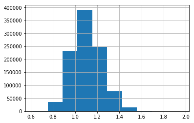
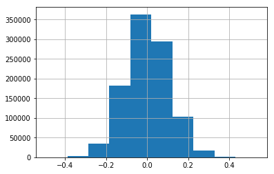
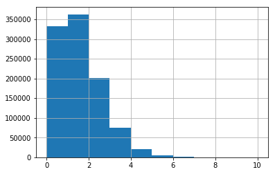
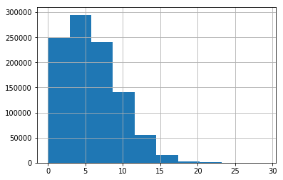

As shown in this github issue: https://github.com/scikit-learn/scikit-learn/issues/5975

I've had many arguements that for poisson regression Counts/Exposures is equivalent to handling the offsets in the optimization loop explicitly. This isn't true as shown later on in this notebook.

The notebook also shows how to do poisson regression with offsets in tensorflow. Pretty baller right.


```python
import numpy as np
import pandas as pd
```


```python
np.random.seed(333)
n = 1000000
df = pd.DataFrame(
    np.random.normal(np.tile(np.arange(10), n), np.tile(np.arange(1, 11) * 2, n), (n * 10)).reshape((n, 10)) / 100)
wts = np.array([-0.1, -0.2, 0, 0, 0.1, 0.2, 0.3, 0.0, 0.25, 0.5])
df['y'] = (df.values * wts).sum(axis=1)
df['rate'] = np.exp(df['y'])
```


```python
df.describe()
```


<div>
<style>
    .dataframe thead tr:only-child th {
        text-align: right;
    }

    .dataframe thead th {
        text-align: left;
    }

    .dataframe tbody tr th {
        vertical-align: top;
    }
</style>
<table border="1" class="dataframe">
  <thead>
    <tr style="text-align: right;">
      <th></th>
      <th>0</th>
      <th>1</th>
      <th>2</th>
      <th>3</th>
      <th>4</th>
      <th>5</th>
      <th>6</th>
      <th>7</th>
      <th>8</th>
      <th>9</th>
      <th>y</th>
      <th>rate</th>
    </tr>
  </thead>
  <tbody>
    <tr>
      <th>count</th>
      <td>1000000.000000</td>
      <td>1000000.000000</td>
      <td>1000000.000000</td>
      <td>1000000.000000</td>
      <td>1000000.000000</td>
      <td>1000000.000000</td>
      <td>1000000.000000</td>
      <td>1000000.000000</td>
      <td>1000000.000000</td>
      <td>1000000.000000</td>
      <td>1000000.000000</td>
      <td>1000000.000000</td>
    </tr>
    <tr>
      <th>mean</th>
      <td>-0.000003</td>
      <td>0.009928</td>
      <td>0.020052</td>
      <td>0.029953</td>
      <td>0.039883</td>
      <td>0.050059</td>
      <td>0.060012</td>
      <td>0.070168</td>
      <td>0.080178</td>
      <td>0.090096</td>
      <td>0.095111</td>
      <td>1.107802</td>
    </tr>
    <tr>
      <th>std</th>
      <td>0.020028</td>
      <td>0.040016</td>
      <td>0.060064</td>
      <td>0.080018</td>
      <td>0.099852</td>
      <td>0.120065</td>
      <td>0.140026</td>
      <td>0.159790</td>
      <td>0.180064</td>
      <td>0.199852</td>
      <td>0.120557</td>
      <td>0.134044</td>
    </tr>
    <tr>
      <th>min</th>
      <td>-0.105630</td>
      <td>-0.209110</td>
      <td>-0.309568</td>
      <td>-0.352887</td>
      <td>-0.421594</td>
      <td>-0.500034</td>
      <td>-0.681308</td>
      <td>-0.690213</td>
      <td>-0.801777</td>
      <td>-0.907063</td>
      <td>-0.481539</td>
      <td>0.617832</td>
    </tr>
    <tr>
      <th>25%</th>
      <td>-0.013521</td>
      <td>-0.017128</td>
      <td>-0.020421</td>
      <td>-0.024039</td>
      <td>-0.027489</td>
      <td>-0.030903</td>
      <td>-0.034518</td>
      <td>-0.037456</td>
      <td>-0.041322</td>
      <td>-0.044670</td>
      <td>0.013792</td>
      <td>1.013888</td>
    </tr>
    <tr>
      <th>50%</th>
      <td>-0.000023</td>
      <td>0.009892</td>
      <td>0.020028</td>
      <td>0.029904</td>
      <td>0.039912</td>
      <td>0.050219</td>
      <td>0.060004</td>
      <td>0.070210</td>
      <td>0.079852</td>
      <td>0.090129</td>
      <td>0.095101</td>
      <td>1.099770</td>
    </tr>
    <tr>
      <th>75%</th>
      <td>0.013515</td>
      <td>0.036934</td>
      <td>0.060464</td>
      <td>0.083954</td>
      <td>0.107181</td>
      <td>0.131026</td>
      <td>0.154161</td>
      <td>0.178102</td>
      <td>0.201702</td>
      <td>0.224866</td>
      <td>0.176557</td>
      <td>1.193102</td>
    </tr>
    <tr>
      <th>max</th>
      <td>0.095576</td>
      <td>0.200082</td>
      <td>0.317362</td>
      <td>0.410525</td>
      <td>0.560201</td>
      <td>0.682567</td>
      <td>0.761380</td>
      <td>0.846154</td>
      <td>0.957091</td>
      <td>1.058712</td>
      <td>0.673366</td>
      <td>1.960826</td>
    </tr>
  </tbody>
</table>
</div>


```python
%matplotlib inline
df.rate.hist()
```


    <matplotlib.axes._subplots.AxesSubplot at 0x7f27c1823048>





```python
df['offset'] = np.random.randint(1, 10, n)
```


```python
(np.random.poisson(df['rate'], (10, n)).T.mean(axis=1) - df.rate).hist()
```


    <matplotlib.axes._subplots.AxesSubplot at 0x7f27c17e1d68>





```python
df['cnt'] = np.random.poisson(df['rate'])
df.cnt.hist()
```


    <matplotlib.axes._subplots.AxesSubplot at 0x7f27c1993358>





```python
import statsmodels.api as sm


mod = sm.GLM(df['cnt'], df[np.arange(10)], family=sm.families.Poisson())

mod = mod.fit()

mod.summary()
```


<table class="simpletable">
<caption>Generalized Linear Model Regression Results</caption>
<tr>
  <th>Dep. Variable:</th>         <td>cnt</td>       <th>  No. Observations:  </th>   <td>1000000</td>  
</tr>
<tr>
  <th>Model:</th>                 <td>GLM</td>       <th>  Df Residuals:      </th>   <td>999990</td>   
</tr>
<tr>
  <th>Model Family:</th>        <td>Poisson</td>     <th>  Df Model:          </th>   <td>     9</td>   
</tr>
<tr>
  <th>Link Function:</th>         <td>log</td>       <th>  Scale:             </th>     <td>1.0</td>    
</tr>
<tr>
  <th>Method:</th>               <td>IRLS</td>       <th>  Log-Likelihood:    </th> <td>-1.3606e+06</td>
</tr>
<tr>
  <th>Date:</th>           <td>Mon, 12 Feb 2018</td> <th>  Deviance:          </th> <td>1.1522e+06</td> 
</tr>
<tr>
  <th>Time:</th>               <td>21:18:44</td>     <th>  Pearson chi2:      </th>  <td>1.00e+06</td>  
</tr>
<tr>
  <th>No. Iterations:</th>         <td>5</td>        <th>                     </th>      <td> </td>     
</tr>
</table>
<table class="simpletable">
<tr>
  <td></td>     <th>coef</th>     <th>std err</th>      <th>z</th>      <th>P>|z|</th>  <th>[0.025</th>    <th>0.975]</th>  
</tr>
<tr>
  <th>0</th> <td>   -0.1093</td> <td>    0.047</td> <td>   -2.303</td> <td> 0.021</td> <td>   -0.202</td> <td>   -0.016</td>
</tr>
<tr>
  <th>1</th> <td>   -0.2031</td> <td>    0.023</td> <td>   -8.646</td> <td> 0.000</td> <td>   -0.249</td> <td>   -0.157</td>
</tr>
<tr>
  <th>2</th> <td>    0.0097</td> <td>    0.015</td> <td>    0.626</td> <td> 0.531</td> <td>   -0.021</td> <td>    0.040</td>
</tr>
<tr>
  <th>3</th> <td>    0.0008</td> <td>    0.012</td> <td>    0.069</td> <td> 0.945</td> <td>   -0.022</td> <td>    0.023</td>
</tr>
<tr>
  <th>4</th> <td>    0.0944</td> <td>    0.009</td> <td>   10.253</td> <td> 0.000</td> <td>    0.076</td> <td>    0.112</td>
</tr>
<tr>
  <th>5</th> <td>    0.1912</td> <td>    0.008</td> <td>   25.097</td> <td> 0.000</td> <td>    0.176</td> <td>    0.206</td>
</tr>
<tr>
  <th>6</th> <td>    0.3053</td> <td>    0.006</td> <td>   47.020</td> <td> 0.000</td> <td>    0.293</td> <td>    0.318</td>
</tr>
<tr>
  <th>7</th> <td>   -0.0041</td> <td>    0.006</td> <td>   -0.716</td> <td> 0.474</td> <td>   -0.015</td> <td>    0.007</td>
</tr>
<tr>
  <th>8</th> <td>    0.2543</td> <td>    0.005</td> <td>   50.560</td> <td> 0.000</td> <td>    0.244</td> <td>    0.264</td>
</tr>
<tr>
  <th>9</th> <td>    0.4978</td> <td>    0.004</td> <td>  111.282</td> <td> 0.000</td> <td>    0.489</td> <td>    0.507</td>
</tr>
</table>


```python
df['cnt'] = [np.random.poisson(rate, offset).sum() for rate, offset in zip(df['rate'], df['offset'])]
```


```python
df.cnt.hist()
```


    <matplotlib.axes._subplots.AxesSubplot at 0x7f27c2181cf8>





```python
import statsmodels.api as sm


mod = sm.GLM(df['cnt'], df[np.arange(10)], offset=np.log(df['offset']), family=sm.families.Poisson())

mod = mod.fit()

mod.summary()
```


<table class="simpletable">
<caption>Generalized Linear Model Regression Results</caption>
<tr>
  <th>Dep. Variable:</th>         <td>cnt</td>       <th>  No. Observations:  </th>   <td>1000000</td>  
</tr>
<tr>
  <th>Model:</th>                 <td>GLM</td>       <th>  Df Residuals:      </th>   <td>999990</td>   
</tr>
<tr>
  <th>Model Family:</th>        <td>Poisson</td>     <th>  Df Model:          </th>   <td>     9</td>   
</tr>
<tr>
  <th>Link Function:</th>         <td>log</td>       <th>  Scale:             </th>     <td>1.0</td>    
</tr>
<tr>
  <th>Method:</th>               <td>IRLS</td>       <th>  Log-Likelihood:    </th> <td>-2.1458e+06</td>
</tr>
<tr>
  <th>Date:</th>           <td>Mon, 12 Feb 2018</td> <th>  Deviance:          </th> <td>1.0616e+06</td> 
</tr>
<tr>
  <th>Time:</th>               <td>21:19:50</td>     <th>  Pearson chi2:      </th>  <td>9.98e+05</td>  
</tr>
<tr>
  <th>No. Iterations:</th>         <td>5</td>        <th>                     </th>      <td> </td>     
</tr>
</table>
<table class="simpletable">
<tr>
  <td></td>     <th>coef</th>     <th>std err</th>      <th>z</th>      <th>P>|z|</th>  <th>[0.025</th>    <th>0.975]</th>  
</tr>
<tr>
  <th>0</th> <td>   -0.0757</td> <td>    0.021</td> <td>   -3.569</td> <td> 0.000</td> <td>   -0.117</td> <td>   -0.034</td>
</tr>
<tr>
  <th>1</th> <td>   -0.2146</td> <td>    0.011</td> <td>  -20.415</td> <td> 0.000</td> <td>   -0.235</td> <td>   -0.194</td>
</tr>
<tr>
  <th>2</th> <td>   -0.0060</td> <td>    0.007</td> <td>   -0.870</td> <td> 0.384</td> <td>   -0.020</td> <td>    0.008</td>
</tr>
<tr>
  <th>3</th> <td>   -0.0071</td> <td>    0.005</td> <td>   -1.369</td> <td> 0.171</td> <td>   -0.017</td> <td>    0.003</td>
</tr>
<tr>
  <th>4</th> <td>    0.1057</td> <td>    0.004</td> <td>   25.683</td> <td> 0.000</td> <td>    0.098</td> <td>    0.114</td>
</tr>
<tr>
  <th>5</th> <td>    0.2010</td> <td>    0.003</td> <td>   59.013</td> <td> 0.000</td> <td>    0.194</td> <td>    0.208</td>
</tr>
<tr>
  <th>6</th> <td>    0.2976</td> <td>    0.003</td> <td>  102.507</td> <td> 0.000</td> <td>    0.292</td> <td>    0.303</td>
</tr>
<tr>
  <th>7</th> <td>   -0.0033</td> <td>    0.003</td> <td>   -1.301</td> <td> 0.193</td> <td>   -0.008</td> <td>    0.002</td>
</tr>
<tr>
  <th>8</th> <td>    0.2496</td> <td>    0.002</td> <td>  111.029</td> <td> 0.000</td> <td>    0.245</td> <td>    0.254</td>
</tr>
<tr>
  <th>9</th> <td>    0.4987</td> <td>    0.002</td> <td>  249.294</td> <td> 0.000</td> <td>    0.495</td> <td>    0.503</td>
</tr>
</table>


```python
import statsmodels.api as sm


mod = sm.GLM(df['cnt'] / df['offset'], df[np.arange(10)], family=sm.families.Poisson())

mod = mod.fit()

mod.summary()
```


<table class="simpletable">
<caption>Generalized Linear Model Regression Results</caption>
<tr>
  <th>Dep. Variable:</th>          <td>y</td>        <th>  No. Observations:  </th>   <td>1000000</td>  
</tr>
<tr>
  <th>Model:</th>                 <td>GLM</td>       <th>  Df Residuals:      </th>   <td>999990</td>   
</tr>
<tr>
  <th>Model Family:</th>        <td>Poisson</td>     <th>  Df Model:          </th>   <td>     9</td>   
</tr>
<tr>
  <th>Link Function:</th>         <td>log</td>       <th>  Scale:             </th>     <td>1.0</td>    
</tr>
<tr>
  <th>Method:</th>               <td>IRLS</td>       <th>  Log-Likelihood:    </th> <td>-1.1432e+06</td>
</tr>
<tr>
  <th>Date:</th>           <td>Mon, 12 Feb 2018</td> <th>  Deviance:          </th> <td>3.4568e+05</td> 
</tr>
<tr>
  <th>Time:</th>               <td>21:25:05</td>     <th>  Pearson chi2:      </th>  <td>3.14e+05</td>  
</tr>
<tr>
  <th>No. Iterations:</th>         <td>5</td>        <th>                     </th>      <td> </td>     
</tr>
</table>
<table class="simpletable">
<tr>
  <td></td>     <th>coef</th>     <th>std err</th>      <th>z</th>      <th>P>|z|</th>  <th>[0.025</th>    <th>0.975]</th>  
</tr>
<tr>
  <th>0</th> <td>   -0.0644</td> <td>    0.047</td> <td>   -1.357</td> <td> 0.175</td> <td>   -0.157</td> <td>    0.029</td>
</tr>
<tr>
  <th>1</th> <td>   -0.2159</td> <td>    0.023</td> <td>   -9.191</td> <td> 0.000</td> <td>   -0.262</td> <td>   -0.170</td>
</tr>
<tr>
  <th>2</th> <td>   -0.0064</td> <td>    0.015</td> <td>   -0.411</td> <td> 0.681</td> <td>   -0.037</td> <td>    0.024</td>
</tr>
<tr>
  <th>3</th> <td>   -0.0102</td> <td>    0.012</td> <td>   -0.883</td> <td> 0.377</td> <td>   -0.033</td> <td>    0.012</td>
</tr>
<tr>
  <th>4</th> <td>    0.1066</td> <td>    0.009</td> <td>   11.574</td> <td> 0.000</td> <td>    0.089</td> <td>    0.125</td>
</tr>
<tr>
  <th>5</th> <td>    0.1994</td> <td>    0.008</td> <td>   26.177</td> <td> 0.000</td> <td>    0.184</td> <td>    0.214</td>
</tr>
<tr>
  <th>6</th> <td>    0.2994</td> <td>    0.006</td> <td>   46.098</td> <td> 0.000</td> <td>    0.287</td> <td>    0.312</td>
</tr>
<tr>
  <th>7</th> <td>   -0.0018</td> <td>    0.006</td> <td>   -0.317</td> <td> 0.752</td> <td>   -0.013</td> <td>    0.009</td>
</tr>
<tr>
  <th>8</th> <td>    0.2511</td> <td>    0.005</td> <td>   49.914</td> <td> 0.000</td> <td>    0.241</td> <td>    0.261</td>
</tr>
<tr>
  <th>9</th> <td>    0.4991</td> <td>    0.004</td> <td>  111.565</td> <td> 0.000</td> <td>    0.490</td> <td>    0.508</td>
</tr>
</table>


```python
from pyglmnet import GLM

# create an instance of the GLM class
glm = GLM(distr='poisson')
glm = glm.fit(df[np.arange(10)].values, df['cnt'].values/df['offset'].values)
glm
```


    <
    Distribution | poisson
    alpha | 0.50
    max_iter | 1000.00
    lambda: 0.50 to 0.01
    >


```python
glm.get_params()
```


    {'Tau': None,
     'alpha': 0.5,
     'distr': 'poisson',
     'eta': 4.0,
     'group': None,
     'learning_rate': 0.2,
     'max_iter': 1000,
     'random_state': 0,
     'reg_lambda': array([ 0.5       ,  0.3237394 ,  0.2096144 ,  0.13572088,  0.08787639,
             0.0568981 ,  0.03684031,  0.02385332,  0.01544452,  0.01      ]),
     'score_metric': 'deviance',
     'tol': 0.001,
     'verbose': False}


```python
import keras

inl = keras.layers.Input((10,))
out = keras.layers.Dense(1, use_bias=False)(inl)
out = keras.layers.Lambda(lambda x: keras.backend.exp(x))(out)
model = keras.models.Model(inl, out)

model.compile(keras.optimizers.Adam(1e-3), 'poisson')
model.summary()
model.fit(df[np.arange(10)], df['cnt']/df['offset'], verbose=1)
```

    _________________________________________________________________
    Layer (type)                 Output Shape              Param #   
    =================================================================
    input_32 (InputLayer)        (None, 10)                0         
    _________________________________________________________________
    dense_22 (Dense)             (None, 1)                 10        
    _________________________________________________________________
    lambda_18 (Lambda)           (None, 1)                 0         
    =================================================================
    Total params: 10
    Trainable params: 10
    Non-trainable params: 0
    _________________________________________________________________
    Epoch 1/1
    1000000/1000000 [==============================] - 25s 25us/step - loss: 0.9870


    <keras.callbacks.History at 0x7f27b93bb898>


```python
model.get_weights()[0].ravel()
```


    array([-0.05754524, -0.23257338,  0.00755339, -0.05471236,  0.12637407,
            0.19810426,  0.2976492 , -0.01716288,  0.26042998,  0.51705188], dtype=float32)


```python
import keras

inl = keras.layers.Input((10,))
out = keras.layers.Dense(1, use_bias=False)(inl)
off = keras.layers.Input((1,))
out = keras.layers.add([out, off])
out = keras.layers.Lambda(lambda x: keras.backend.exp(x))(out)

model = keras.models.Model([inl, off], out)

model.compile(keras.optimizers.Adam(1e-3), 'poisson')
model.summary()
model.fit([df[np.arange(10)], np.log(df['offset'])], df['cnt'], verbose=1)
```

    __________________________________________________________________________________________________
    Layer (type)                    Output Shape         Param #     Connected to                     
    ==================================================================================================
    input_29 (InputLayer)           (None, 10)           0                                            
    __________________________________________________________________________________________________
    dense_20 (Dense)                (None, 1)            10          input_29[0][0]                   
    __________________________________________________________________________________________________
    input_30 (InputLayer)           (None, 1)            0                                            
    __________________________________________________________________________________________________
    add_3 (Add)                     (None, 1)            0           dense_20[0][0]                   
                                                                     input_30[0][0]                   
    __________________________________________________________________________________________________
    lambda_16 (Lambda)              (None, 1)            0           add_3[0][0]                      
    ==================================================================================================
    Total params: 10
    Trainable params: 10
    Non-trainable params: 0
    __________________________________________________________________________________________________
    Epoch 1/1
    1000000/1000000 [==============================] - 25s 25us/step - loss: -4.7883


    <keras.callbacks.History at 0x7f27afa61e10>


```python
model.get_weights()[0].ravel()
```


    array([-0.09250503, -0.19198173, -0.04260972, -0.02864283,  0.11696044,
            0.20959049,  0.29357442, -0.02965078,  0.23306984,  0.48882231], dtype=float32)


```python
# now with unequal number of exposures we need to use the offsets correctly to get the right answer
```


```python
offsets = np.arange(1, 101)
import itertools
offsets=np.array(list(itertools.chain.from_iterable([np.repeat(i, off) for i, off in enumerate(offsets)])))
X=np.array([x/100 for x in offsets])[:, np.newaxis]
X.shape, offsets.shape
```


    ((5050, 1), (5050,))


```python
y=np.random.poisson(np.exp(X*1.2+.33)).ravel()
y.shape
```


    (5050,)


```python
mod = sm.GLM(y, sm.add_constant(X), family=sm.families.Poisson())

mod = mod.fit()

mod.summary()
```


<table class="simpletable">
<caption>Generalized Linear Model Regression Results</caption>
<tr>
  <th>Dep. Variable:</th>          <td>y</td>        <th>  No. Observations:  </th>  <td>  5050</td> 
</tr>
<tr>
  <th>Model:</th>                 <td>GLM</td>       <th>  Df Residuals:      </th>  <td>  5048</td> 
</tr>
<tr>
  <th>Model Family:</th>        <td>Poisson</td>     <th>  Df Model:          </th>  <td>     1</td> 
</tr>
<tr>
  <th>Link Function:</th>         <td>log</td>       <th>  Scale:             </th>    <td>1.0</td>  
</tr>
<tr>
  <th>Method:</th>               <td>IRLS</td>       <th>  Log-Likelihood:    </th> <td> -9733.6</td>
</tr>
<tr>
  <th>Date:</th>           <td>Mon, 12 Feb 2018</td> <th>  Deviance:          </th> <td>  5327.1</td>
</tr>
<tr>
  <th>Time:</th>               <td>22:54:05</td>     <th>  Pearson chi2:      </th> <td>4.88e+03</td>
</tr>
<tr>
  <th>No. Iterations:</th>         <td>4</td>        <th>                     </th>     <td> </td>   
</tr>
</table>
<table class="simpletable">
<tr>
    <td></td>       <th>coef</th>     <th>std err</th>      <th>z</th>      <th>P>|z|</th>  <th>[0.025</th>    <th>0.975]</th>  
</tr>
<tr>
  <th>const</th> <td>    0.3279</td> <td>    0.028</td> <td>   11.874</td> <td> 0.000</td> <td>    0.274</td> <td>    0.382</td>
</tr>
<tr>
  <th>x1</th>    <td>    1.2006</td> <td>    0.037</td> <td>   32.733</td> <td> 0.000</td> <td>    1.129</td> <td>    1.272</td>
</tr>
</table>


```python
Xg=pd.DataFrame(X).groupby(offsets).mean().values
yg=pd.DataFrame(y).groupby(offsets).sum().values.ravel()
Xg.shape, yg.shape
```


    ((100, 1), (100,))


```python
offsetsg = pd.DataFrame(offsets).groupby(offsets).size().values.ravel()
```


```python
mod = sm.GLM(yg, sm.add_constant(Xg), offset=np.log(offsetsg), family=sm.families.Poisson())

mod = mod.fit()

mod.summary()
```


<table class="simpletable">
<caption>Generalized Linear Model Regression Results</caption>
<tr>
  <th>Dep. Variable:</th>          <td>y</td>        <th>  No. Observations:  </th>  <td>   100</td> 
</tr>
<tr>
  <th>Model:</th>                 <td>GLM</td>       <th>  Df Residuals:      </th>  <td>    98</td> 
</tr>
<tr>
  <th>Model Family:</th>        <td>Poisson</td>     <th>  Df Model:          </th>  <td>     1</td> 
</tr>
<tr>
  <th>Link Function:</th>         <td>log</td>       <th>  Scale:             </th>    <td>1.0</td>  
</tr>
<tr>
  <th>Method:</th>               <td>IRLS</td>       <th>  Log-Likelihood:    </th> <td> -368.64</td>
</tr>
<tr>
  <th>Date:</th>           <td>Mon, 12 Feb 2018</td> <th>  Deviance:          </th> <td>  97.737</td>
</tr>
<tr>
  <th>Time:</th>               <td>22:56:15</td>     <th>  Pearson chi2:      </th>  <td>  98.3</td> 
</tr>
<tr>
  <th>No. Iterations:</th>         <td>5</td>        <th>                     </th>     <td> </td>   
</tr>
</table>
<table class="simpletable">
<tr>
    <td></td>       <th>coef</th>     <th>std err</th>      <th>z</th>      <th>P>|z|</th>  <th>[0.025</th>    <th>0.975]</th>  
</tr>
<tr>
  <th>const</th> <td>    0.3279</td> <td>    0.028</td> <td>   11.874</td> <td> 0.000</td> <td>    0.274</td> <td>    0.382</td>
</tr>
<tr>
  <th>x1</th>    <td>    1.2006</td> <td>    0.037</td> <td>   32.733</td> <td> 0.000</td> <td>    1.129</td> <td>    1.272</td>
</tr>
</table>


```python
mod = sm.GLM(yg/offsetsg, sm.add_constant(Xg), family=sm.families.Poisson())

mod = mod.fit()
mod.summary()
```


<table class="simpletable">
<caption>Generalized Linear Model Regression Results</caption>
<tr>
  <th>Dep. Variable:</th>          <td>y</td>        <th>  No. Observations:  </th>  <td>   100</td> 
</tr>
<tr>
  <th>Model:</th>                 <td>GLM</td>       <th>  Df Residuals:      </th>  <td>    98</td> 
</tr>
<tr>
  <th>Model Family:</th>        <td>Poisson</td>     <th>  Df Model:          </th>  <td>     1</td> 
</tr>
<tr>
  <th>Link Function:</th>         <td>log</td>       <th>  Scale:             </th>    <td>1.0</td>  
</tr>
<tr>
  <th>Method:</th>               <td>IRLS</td>       <th>  Log-Likelihood:    </th> <td> -144.13</td>
</tr>
<tr>
  <th>Date:</th>           <td>Mon, 12 Feb 2018</td> <th>  Deviance:          </th> <td>  5.7707</td>
</tr>
<tr>
  <th>Time:</th>               <td>22:57:02</td>     <th>  Pearson chi2:      </th>  <td>  6.43</td> 
</tr>
<tr>
  <th>No. Iterations:</th>         <td>4</td>        <th>                     </th>     <td> </td>   
</tr>
</table>
<table class="simpletable">
<tr>
    <td></td>       <th>coef</th>     <th>std err</th>      <th>z</th>      <th>P>|z|</th>  <th>[0.025</th>    <th>0.975]</th>  
</tr>
<tr>
  <th>const</th> <td>    0.3547</td> <td>    0.143</td> <td>    2.485</td> <td> 0.013</td> <td>    0.075</td> <td>    0.634</td>
</tr>
<tr>
  <th>x1</th>    <td>    1.1635</td> <td>    0.219</td> <td>    5.320</td> <td> 0.000</td> <td>    0.735</td> <td>    1.592</td>
</tr>
</table>


```python
# wow amazing dividing by exposures doesn't work!!!! Guess you actually have use the math to be correct :)
```


```python
# bonus let's try tensorflow
```


```python
import keras

inl = keras.layers.Input((2,))
out = keras.layers.Dense(1, use_bias=False)(inl)
off = keras.layers.Input((1,))
out = keras.layers.add([out, off])
out = keras.layers.Lambda(lambda x: keras.backend.exp(x))(out)

model = keras.models.Model([inl, off], out)

model.compile(keras.optimizers.SGD(1e-19), 'poisson')
model.summary()
model.fit([sm.add_constant(Xg), np.log(offsetsg)], yg, verbose=1, epochs=1)
```

    __________________________________________________________________________________________________
    Layer (type)                    Output Shape         Param #     Connected to                     
    ==================================================================================================
    input_145 (InputLayer)          (None, 2)            0                                            
    __________________________________________________________________________________________________
    dense_79 (Dense)                (None, 1)            2           input_145[0][0]                  
    __________________________________________________________________________________________________
    input_146 (InputLayer)          (None, 1)            0                                            
    __________________________________________________________________________________________________
    add_60 (Add)                    (None, 1)            0           dense_79[0][0]                   
                                                                     input_146[0][0]                  
    __________________________________________________________________________________________________
    lambda_75 (Lambda)              (None, 1)            0           add_60[0][0]                     
    ==================================================================================================
    Total params: 2
    Trainable params: 2
    Non-trainable params: 0
    __________________________________________________________________________________________________
    Epoch 1/1
    100/100 [==============================] - 1s 6ms/step - loss: -499.4098


    <keras.callbacks.History at 0x7f27a15dfe80>


```python
model.get_weights()[0]
```


    array([[-1.10750854],
           [ 0.13667548]], dtype=float32)


